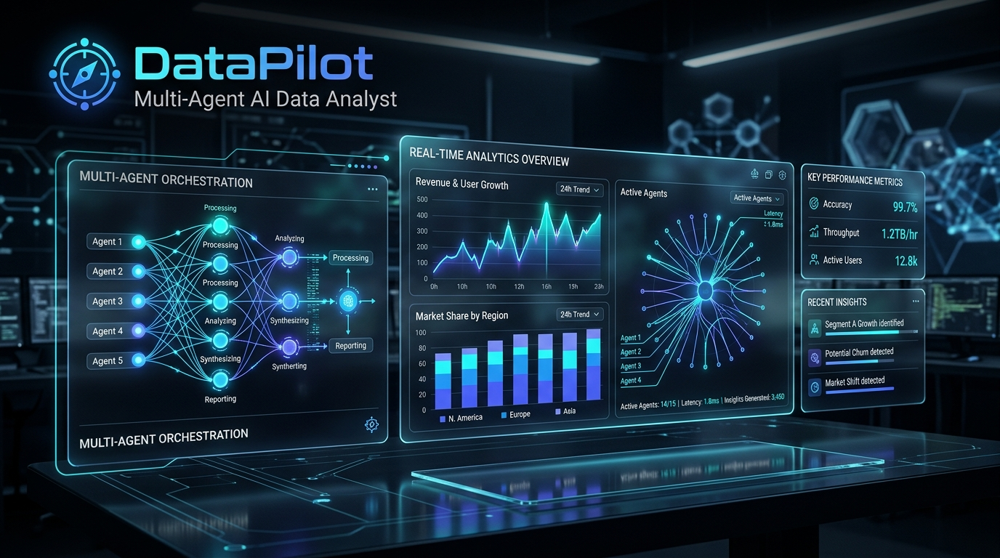
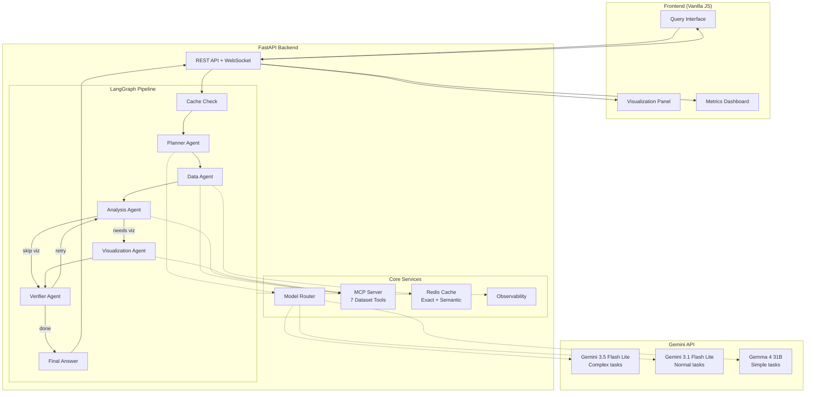

# DataPilot — Multi-Agentic AI Data Analyst

A focused multi-agent AI system that lets users ask natural-language questions about structured datasets and receive verified analytical answers with visualizations.

Built with **5 specialized LLM agents**, orchestrated by **LangGraph**, powered by **Gemini API** models with intelligent routing, and optimized with **Redis caching** (exact + semantic).

<p align="center">
  
</p>

---

## Architecture



---

## Features

| Feature | Description |
|---------|-------------|
| **5-Agent Pipeline** | Planner → Data → Analysis → Visualization → Verifier |
| **Intelligent Model Routing** | Complexity-aware routing across 3 Gemini/Gemma models |
| **MCP Tool Server** | 7 dataset tools: schema, sample, filter, aggregate, query, python analysis, visualization |
| **Dual Caching** | Redis exact cache + semantic similarity cache with cross-dataset isolation |
| **Verification Loop** | Verifier agent validates answers with retry on failure |
| **Conditional Execution** | Skip visualization when unnecessary, skip agents for cached results |
| **Evaluation Pipeline** | 100 benchmark questions across 3 configurations (baseline vs optimized) |
| **Premium UI** | Dark glassmorphism theme, agent timeline, cache/model indicators |
| **Observability** | Request tracking, latency percentiles, model usage, structured logging |

---

## Quick Start

### Prerequisites
- Python 3.10+
- Google API Key ([Get one here](https://aistudio.google.com/apikey))
- Optional: Upstash Redis account (free tier)

### Setup

```bash
# Clone the repository
git clone <repo-url>
cd "Multi-Agentic AI Data Analyst"

# Create virtual environment
python -m venv venv
# Windows
.\venv\Scripts\activate
# macOS/Linux
source venv/bin/activate

# Install dependencies
pip install -r requirements.txt

# Configure environment
cp .env.example .env
# Edit .env and add your GOOGLE_API_KEY
```

### Run the Backend

You can start the backend from the project root:

```bash
# Option 1 (Recommended from root):
python run.py

# Option 2 (Using uvicorn with app-dir from root):
uvicorn app.main:app --reload --port 8000 --app-dir backend

# Option 3 (From backend folder):
cd backend
uvicorn app.main:app --reload --port 8000
```

### Open the Application

The frontend is served directly by the FastAPI backend — no separate server needed.

Visit **http://localhost:8000** in your browser.

---

## Usage

1. **Select a Dataset** — Choose the pre-loaded `sample_sales` dataset or upload your own CSV
2. **Ask a Question** — Type a natural-language analytical question
3. **View Results** — See the verified answer, generated chart, and agent execution timeline
4. **Check Metrics** — Switch to the Metrics tab for system performance data

### Example Questions

- *"Which category had the highest revenue growth?"*
- *"What are the top 5 customers by revenue?"*
- *"Is there a correlation between quantity sold and profit margin?"*
- *"Show me the revenue breakdown by region"*

---

## Evaluation

Run the benchmark evaluation pipeline (~100 questions):

```bash
cd backend

# Dry run (no API calls, tests pipeline structure)
python -m evaluation.run_eval --config all --dry-run

# Full evaluation (uses API tokens)
python -m evaluation.run_eval --config all

# Single configuration with limited questions
python -m evaluation.run_eval --config experiment_a --max-questions 10
```

### Configurations

| Config | Router | Caching | Purpose |
|--------|--------|---------|---------|
| **Baseline** | Always Gemini 3.5 Flash Lite | None | Control group |
| **Experiment A** | Intelligent routing | None | Measures routing impact |
| **Experiment B** | Intelligent routing | Redis + Semantic | Full optimization |

Results are saved to `evaluation_results.csv`, `evaluation_results.json`, and `METRICS.md`.

---

## Testing

```bash
cd backend
python -m pytest tests/ -v
```

---

## Deployment

### Docker

The entire application (API + frontend) runs as a **single container**:

```bash
# Build and run
docker-compose up --build

# Application: http://localhost:8000
```

### Cloud Deployment

- **Application** → Deploy to [Render](https://render.com) as a Docker web service. Set environment variables in the Render dashboard.
- **Redis** → Create a free database at [Upstash](https://upstash.com).

> No separate frontend hosting (Vercel, Netlify, etc.) is needed — everything is served from a single origin on port 8000.

---

## Project Structure

```
├── assets/                # Project visuals & architecture banners
├── backend/
│   ├── app/
│   │   ├── agents/        # 5 specialized agents + LangGraph workflow
│   │   ├── cache/         # Redis exact cache + semantic cache
│   │   ├── mcp/           # MCP server with 7 dataset tools
│   │   ├── router/        # Complexity-aware model routing
│   │   ├── observability/ # Metrics + structured logging
│   │   ├── config.py      # Pydantic settings
│   │   ├── models.py      # API request/response models
│   │   └── main.py        # FastAPI application (serves frontend + API)
│   ├── evaluation/        # Benchmark pipeline (~100 examples)
│   ├── tests/             # Unit + integration tests
│   └── data/              # Sample datasets
├── frontend/              # Served as static files by FastAPI
│   ├── index.html         # Single-page app
│   ├── css/styles.css     # Premium dark theme
│   └── js/                # App logic, API client, components, charts
├── run.py                 # Root launcher script
├── requirements.txt       # Python dependencies
├── Dockerfile             # Single-container build
├── docker-compose.yml     # Docker orchestration
├── .env.example           # Environment template
└── README.md
```

---

## Technology Stack

| Layer | Technology |
|-------|-----------| 
| Backend | Python, FastAPI, LangGraph, Pydantic |
| LLM | Gemini 3.5 Flash Lite, Gemini 3.1 Flash Lite, Gemma 4 31B |
| Tools | Custom MCP server (Pandas-based) |
| Cache | Upstash Redis (exact + semantic) |
| Frontend | Vanilla JavaScript, Chart.js (served by FastAPI) |
| Deployment | Docker, Render |

---

## License

MIT

